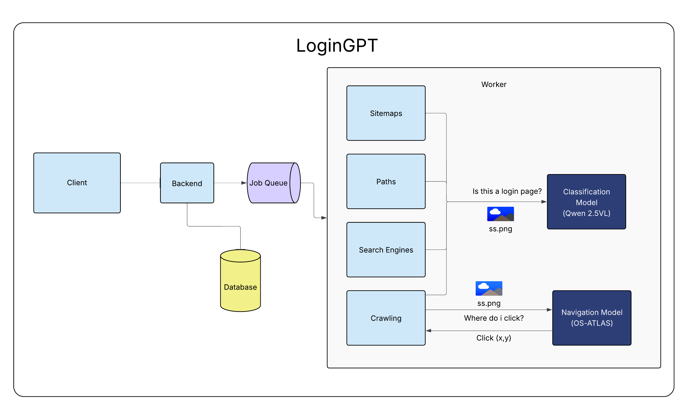

# LoginGPT-Enhanced SSO-Monitor

<p align="center"></p>

This is a modified version of the original [SSO-Monitor](https://github.com/RUB-NDS/SSO-Monitor) framework, enhanced with LoginGPT - an advanced LLM-based login page crawler that uses Vision Language Models for superior login page detection. LoginGPT significantly outperforms traditional heuristic-based crawlers by leveraging visual understanding of web pages rather than relying on keyword matching or form analysis.

## Key Enhancements

- **LoginGPT Integration**: Advanced login page detection using OS-ATLAS and Qwen2.5-VL models
- **Vision-Language Model Support**: Real-time image analysis for login element detection
- **Improved Accuracy**: Superior login page discovery compared to existing crawlers like Double-Edged Sword and original SSO-Monitor
- **Multi-language Support**: Works across different languages and website designs

## 🚀 Quick Start

### Prerequisites
- [Ubuntu 22.04](https://releases.ubuntu.com/jammy/) (or similar)
- [Docker](https://docs.docker.com/get-docker/) and [Docker-Compose](https://docs.docker.com/compose/install/)
- NVIDIA GPU with atleast CUDA 12.1 support for Vision Language Models
- Python environment with vLLM dependencies (install vllm using pip)
- Ensure ports `80`, `443`, `5672`, `8084`, `27017`, `8085`, `9000`, `9090`, `6379`, `8082`, `8888`, `5000`, `5060`, `8001`, and `8002` are free

### Installation Steps

1. **Clone the repository**
   ```bash
   git clone https://github.com/RUB-NDS/SSO-Monitor.git
   cd ./SSO-Monitor
   ```

2. **Start the Vision Language Model backend** (OS-ATLAS for element detection)
   ```bash
   cd worker-backend
   python vllm_backend.py
   ```
   *This service runs the OS-ATLAS model server that identifies clickable login elements in screenshots. It listens on port 5000 and processes image analysis requests from the crawler.*

3. **Start the classification backend** (in a new terminal)
   ```bash
   cd worker-backend
   python classify_screenshots_parallel.py
   ```
   *This service runs the Qwen2.5-VL model to classify whether screenshots contain login forms. It operates on port 5060 and determines if a page is actually a login page.*

4. **Host screenshot images locally** (in a new terminal)
   ```bash
   cd worker/modules/loginpagedetection/screenshot_flows
   python -m http.server 8001
   ```
   *Serves screenshot images via HTTP so the Vision Language Models can access them for analysis.*

5. **Start the OS-ATLAS model server** (in a new terminal). Remove CUDA_VISIBLE_DEVICES parameter if you are using a single large GPU for this. We used 2 GPUs each hosting a separate model
   ```bash
   CUDA_VISIBLE_DEVICES=1 vllm serve "OS-Copilot/OS-Atlas-Base-7B" --max-model-len 8192 --gpu-memory-utilization 0.9 --api-key token-abc123 --port 8002
   ```
   *Runs the OS-ATLAS vision model that performs GUI element grounding and click point detection.*

6. **Start the Qwen2.5-VL classification server** (in a new terminal)
   ```bash
   CUDA_VISIBLE_DEVICES=0 vllm serve "Qwen/Qwen2.5-VL-7B-Instruct" --max-model-len 8192 --gpu-memory-utilization 0.93 --api-key token-abc123 --max-num-seqs 35 --max-num-batched-tokens 20480 --block-size 32 --swap-space 8 --enforce-eager --disable-custom-all-reduce
   ```
   *Runs the Qwen2.5-VL model for login form classification and visual reasoning.*

7. **Build and start the main application**
   ```bash
   docker-compose build
   docker-compose up
   ```

8. **Access the web interface**
   - Main interface: `http://localhost:8084` (default credentials: `admin:changeme`)
   - Database interface: `http://localhost:8085` (mongo-express)
   - File storage: `http://localhost:9090` (minio)

## Backend Services Explained

### vllm_backend.py
*This service acts as a socket server that handles GUI element detection using the OS-ATLAS model. It:*
- *Receives screenshot paths from the crawler*
- *Converts file paths to HTTP URLs for model access*
- *Uses OS-ATLAS to identify clickable elements (login buttons, popup close buttons)*
- *Maintains task state to differentiate between popup detection and login element detection*
- *Returns precise click coordinates for automated interaction*
- *Supports multi-threaded client connections for scalability*

### classify_screenshots_parallel.py  
*This service provides login page classification using the Qwen2.5-VL model. It:*
- *Operates as a socket server listening for classification requests*
- *Analyzes screenshots to determine if they contain login forms*
- *Uses chain-of-thought reasoning to identify username/password fields*
- *Returns binary YES/NO classifications*
- *Optionally saves positive login page images for analysis*
- *Handles concurrent classification requests through threading*

## 🔍 Scanning with LoginGPT

1. *Navigate to the admin dashboard:* `http://localhost:8084/admin`
2. *Under "Run New Analyses", click on "Landscape"*
3. *Enter your target domain under "Domain"*
4. *Configure scan settings (40+ configuration options available)*
5. *Click "Run Analysis"*
6. *LoginGPT will automatically:*
   - *Use Vision Language Models to detect login elements*
   - *Navigate complex login flows (dropdown selections, multi-step authentication)*
   - *Handle cookie banners and popups automatically*
   - *Classify discovered pages as login pages or not*
7. *View results at* `http://localhost:8085/db/sso-monitor/landscape_analysis_tres`

## 👾 Troubleshooting

### Reset SSO-Monitor
```bash
# Stop the application
docker-compose down

# Remove all volumes
docker volume rm sso-monitor-2_db sso-monitor-2_jupyter-home sso-monitor-2_minio sso-monitor-2_rabbitmq-mnesia sso-monitor-2_redis-data sso-monitor-2_traefik-acme sso-monitor-2_traefik-logs

# Restart
docker-compose up
```

### Common Issues
- **GPU Memory**: *Ensure sufficient GPU memory for both Vision Language Models*
- **Port Conflicts**: *Verify all required ports are available*
- **Model Loading**: *First run may take time to download Vision Language Models*
- **Image Access**: *Ensure the HTTP server on port 8001 is accessible to the models*

## Important Note

**Lines 204-212 in file `worker/modules/helper/rabbit.py` are meant to concurrently send the login page links to our subsequent VisibleV8 crawler. This work is currently submitted to NDSS pending review - more details will be attached shortly.**

## Acknowledgments

*This enhanced version builds upon the original [SSO-Monitor](https://github.com/RUB-NDS/SSO-Monitor) framework developed by the RUB-NDS team. LoginGPT integration adds advanced Vision Language Model capabilities for superior login page detection and automated web navigation.*

## ⁉️ Questions and Feedback

*For questions about the LoginGPT enhancements, please raise an [issue](https://github.com/RUB-NDS/SSO-Monitor/issues). For questions about the original SSO-Monitor framework, refer to the [original repository](https://github.com/RUB-NDS/SSO-Monitor).*
